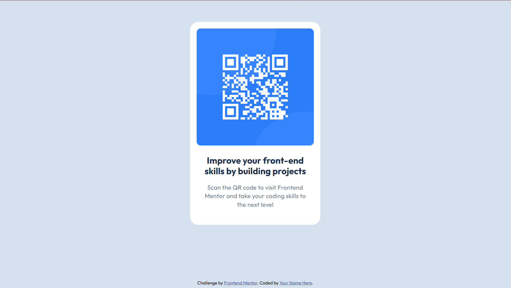

# Frontend Mentor - QR code component solution

This is a solution to the [QR code component challenge on Frontend Mentor](https://www.frontendmentor.io/challenges/qr-code-component-iux_sIO_H). Frontend Mentor challenges help you improve your coding skills by building realistic projects.

## Table of contents

- [Overview](#overview)
  - [Screenshot](#screenshot)
  - [Links](#links)
- [My process](#my-process)
  - [Built with](#built-with)
  - [What I learned](#what-i-learned)
  - [Continued development](#continued-development)
- [Author](#author)

## Overview

### Screenshot



### Links

- Solution URL: [https://github.com/tasosbeast/frontendmentor-io/tree/main/qr-code-component-main](https://github.com/tasosbeast/frontendmentor-io/tree/main/qr-code-component-main)
- Live Site URL: [https://dainty-florentine-e02782.netlify.app/](https://dainty-florentine-e02782.netlify.app/)

## My process

### Built with

- Semantic HTML5 markup (using semantic tags like `section`)
- CSS custom properties (using `:root` variables)
- Flexbox (for card content layout)
- CSS Grid (for page centering)
- Modern CSS Reset

### What I learned

Throughout this project, I gained valuable experience with utility classes and modern CSS practices. Here are some key learnings:

1. Creating reusable utility classes for consistent layouts:

```css
.flex-column {
  display: flex;
  flex-direction: column;
}

.gap {
  gap: var(--spacing-200);
}

.outfit-bold {
  font-weight: 700;
}

.outfit-regular {
  font-weight: 400;
}
```

2. Applying utility classes efficiently in HTML:

```html
<section class="card">
  <div class="card-content flex-column gap">
    <h1 class="content-title outfit-bold">Improve your front-end skills</h1>
    <p class="content-text outfit-regular">Scan the QR code</p>
  </div>
</section>
```

3. Using CSS variables for maintainable styling:

```css
:root {
  --slate-900: #1f314f;
  --slate-500: #68778d;
  --spacing-200: 1rem;
  --spacing-500: 2.5rem;
}
```

This approach to utility classes:

- Reduces CSS repetition
- Makes HTML more maintainable
- Provides consistent spacing and typography
- Makes future updates easier by centralizing common values
- Follows modern CSS best practices

### Continued development

In my future projects, I want to focus on:

1. **Responsive Design**

   - Improve my understanding of responsive breakpoints
   - Master fluid typography and spacing
   - Better handle images in responsive layouts
   - Practice mobile-first development approach

2. **Project Initialization & Workflow**
   - Create a more structured project setup process
   - Develop a personal CSS reset/normalize template
   - Build a collection of reusable utility classes
   - Implement better file organization patterns
   - Set up efficient development environments with tools like:
     - CSS preprocessors
     - Build tools
     - Version control workflows
     - Code formatting standards

These areas will help me create more maintainable and scalable projects while improving the overall development experience.

## Author

- Frontend Mentor - [@tasosbeast](https://www.frontendmentor.io/profile/tasosbeast)
